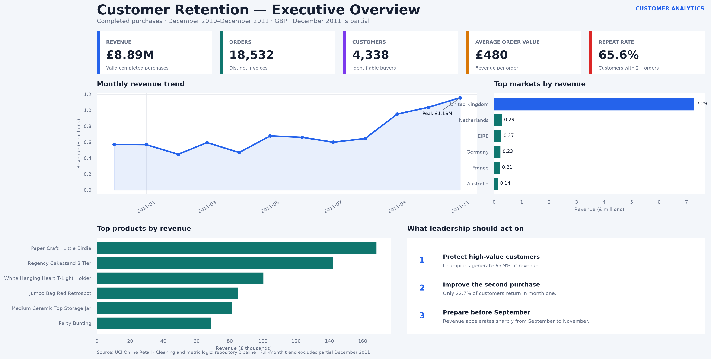
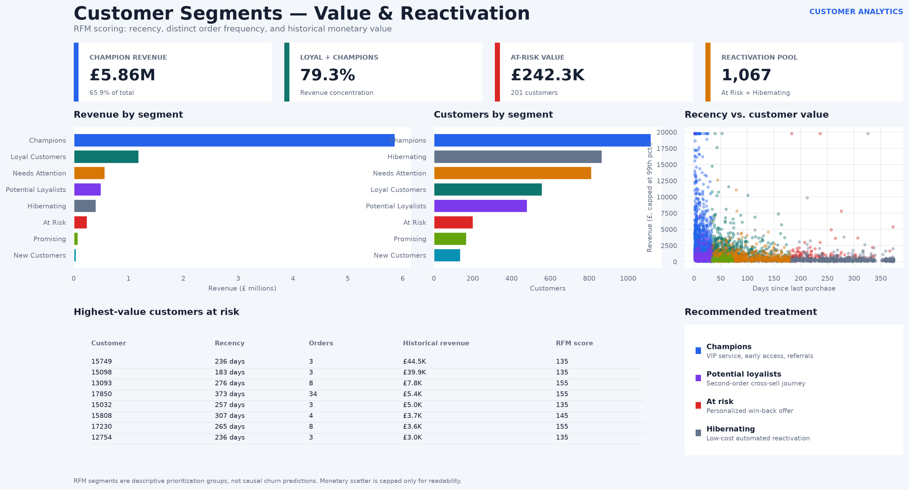
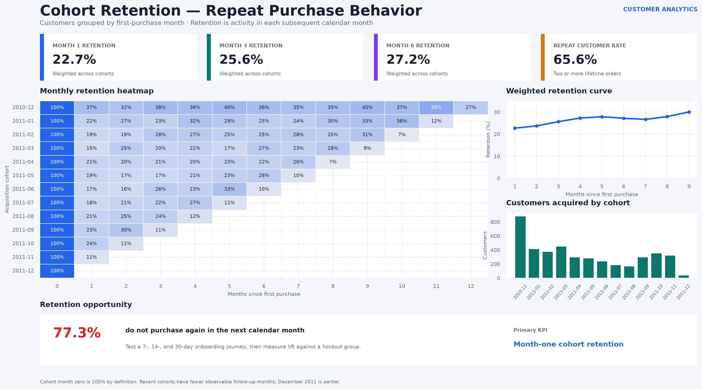

# Dashboard portfolio

This folder contains the Power BI implementation kit and three full-data page
previews. The preview generator uses the same processed tables and metric logic
documented for Power BI, so the numbers can be validated before visual styling.

## Preview pages

### Executive overview

### Customer segments

### Cohort retention

## Native Power BI implementation

- [`powerbi/build-guide.md`](powerbi/build-guide.md): exact construction steps
- [`powerbi/model.md`](powerbi/model.md): tables, relationships, and data types
- [`powerbi/measures.dax`](powerbi/measures.dax): calculated table and measures
- [`powerbi/CustomerRetentionTheme.json`](powerbi/CustomerRetentionTheme.json): report theme

The native `.pbix` must be assembled in Power BI Desktop. The project is kept
reproducible in source control through its inputs, transformations, measures,
theme, page specification, and exported page images.
